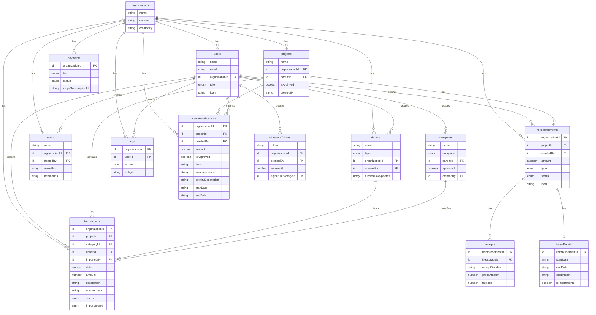

# Database Schema

```mermaid
erDiagram
    organizations {
        string name
        string domain
        string createdBy
    }

    users {
        string name
        string email
        id organizationId FK
        enum role
        string iban
    }

    projects {
        string name
        id organizationId FK
        id parentId FK
        boolean isArchived
        string createdBy
    }

    transactions {
        id organizationId FK
        id projectId FK
        id categoryId FK
        id donorId FK
        id importedBy FK
        number date
        number amount
        string description
        string counterparty
        enum status
        enum importSource
    }

    categories {
        string name
        enum taxsphere
        id parentId FK
        boolean approved
        id createdBy FK
    }

    donors {
        string name
        enum type
        id organizationId FK
        id createdBy FK
        array allowedTaxSpheres
    }

    teams {
        string name
        id organizationId FK
        id createdBy FK
        array projectIds
        array memberIds
    }

    reimbursements {
        id organizationId FK
        id projectId FK
        id createdBy FK
        number amount
        enum type
        enum status
        string iban
    }

    receipts {
        id reimbursementId FK
        id fileStorageId FK
        string receiptNumber
        number grossAmount
        number taxRate
    }

    travelDetails {
        id reimbursementId FK
        string startDate
        string endDate
        string destination
        boolean isInternational
    }

    payments {
        id organizationId FK
        enum tier
        enum status
        string stripeSubscriptionId
    }

    logs {
        id organizationId FK
        id userId FK
        string action
        string entityId
    }

    volunteerAllowance {
        id organizationId FK
        id projectId FK
        id createdBy FK
        number amount
        boolean isApproved
        string iban
        string volunteerName
        string activityDescription
        string startDate
        string endDate
    }

    signatureTokens {
        string token
        id organizationId FK
        id createdBy FK
        number expiresAt
        id signatureStorageId FK
    }

    organizations ||--o{ users : "has"
    organizations ||--o{ projects : "has"
    organizations ||--o{ transactions : "has"
    organizations ||--o{ donors : "has"
    organizations ||--o{ teams : "has"
    organizations ||--o{ reimbursements : "has"
    organizations ||--o{ payments : "has"
    organizations ||--o{ logs : "has"

    users ||--o{ transactions : "imports"
    users ||--o{ reimbursements : "submits"
    users ||--o{ logs : "creates"
    users ||--o{ donors : "creates"
    users ||--o{ teams : "creates"
    users ||--o{ categories : "creates"

    projects ||--o{ transactions : "contains"
    projects ||--o{ reimbursements : "has"

    donors ||--o{ transactions : "funds"

    categories ||--o{ transactions : "classifies"

    reimbursements ||--o{ receipts : "has"
    reimbursements ||--o| travelDetails : "has"

    organizations ||--o{ volunteerAllowance : "has"
    projects ||--o{ volunteerAllowance : "has"
    users ||--o{ volunteerAllowance : "submits"
    users ||--o{ signatureTokens : "creates"
```
