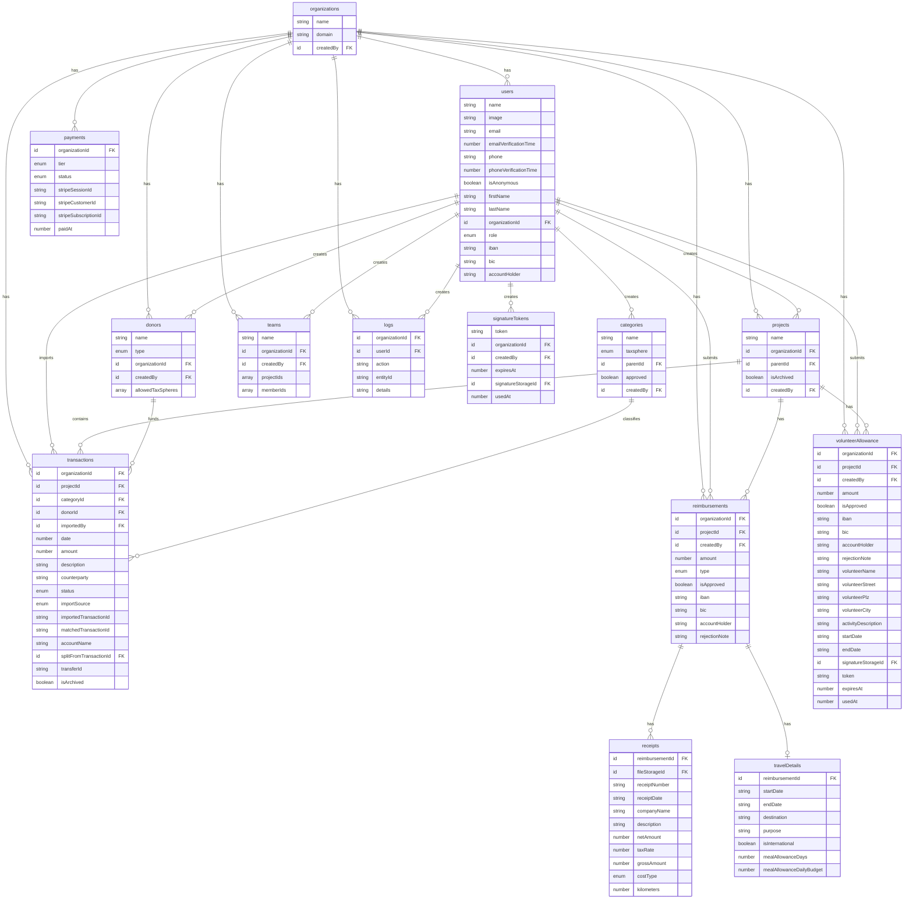

# Database Schema

```mermaid
erDiagram
    organizations {
        string name
        string domain
        id createdBy FK
    }

    users {
        string name
        string image
        string email
        number emailVerificationTime
        string phone
        number phoneVerificationTime
        boolean isAnonymous
        string firstName
        string lastName
        id organizationId FK
        enum role
        string iban
        string bic
        string accountHolder
    }

    projects {
        string name
        id organizationId FK
        id parentId FK
        boolean isArchived
        id createdBy FK
    }

    transactions {
        id organizationId FK
        id projectId FK
        id categoryId FK
        id donorId FK
        id importedBy FK
        number date
        number amount
        string description
        string counterparty
        enum status
        enum importSource
        string importedTransactionId
        string matchedTransactionId
        string accountName
        id splitFromTransactionId FK
        string transferId
        boolean isArchived
    }

    categories {
        string name
        enum taxsphere
        id parentId FK
        boolean approved
        id createdBy FK
    }

    donors {
        string name
        enum type
        id organizationId FK
        id createdBy FK
        array allowedTaxSpheres
    }

    teams {
        string name
        id organizationId FK
        id createdBy FK
        array projectIds
        array memberIds
    }

    reimbursements {
        id organizationId FK
        id projectId FK
        id createdBy FK
        number amount
        enum type
        boolean isApproved
        string iban
        string bic
        string accountHolder
        string rejectionNote
    }

    receipts {
        id reimbursementId FK
        id fileStorageId FK
        string receiptNumber
        string receiptDate
        string companyName
        string description
        number netAmount
        number taxRate
        number grossAmount
        enum costType
        number kilometers
    }

    travelDetails {
        id reimbursementId FK
        string startDate
        string endDate
        string destination
        string purpose
        boolean isInternational
        number mealAllowanceDays
        number mealAllowanceDailyBudget
    }

    payments {
        id organizationId FK
        enum tier
        enum status
        string stripeSessionId
        string stripeCustomerId
        string stripeSubscriptionId
        number paidAt
    }

    logs {
        id organizationId FK
        id userId FK
        string action
        string entityId
        string details
    }

    volunteerAllowance {
        id organizationId FK
        id projectId FK
        id createdBy FK
        number amount
        boolean isApproved
        string iban
        string bic
        string accountHolder
        string rejectionNote
        string volunteerName
        string volunteerStreet
        string volunteerPlz
        string volunteerCity
        string activityDescription
        string startDate
        string endDate
        id signatureStorageId FK
        string token
        number expiresAt
        number usedAt
    }

    signatureTokens {
        string token
        id organizationId FK
        id createdBy FK
        number expiresAt
        id signatureStorageId FK
        number usedAt
    }

    organizations ||--o{ users : "has"
    organizations ||--o{ projects : "has"
    organizations ||--o{ transactions : "has"
    organizations ||--o{ donors : "has"
    organizations ||--o{ teams : "has"
    organizations ||--o{ reimbursements : "has"
    organizations ||--o{ payments : "has"
    organizations ||--o{ logs : "has"
    organizations ||--o{ volunteerAllowance : "has"

    users ||--o{ transactions : "imports"
    users ||--o{ reimbursements : "submits"
    users ||--o{ logs : "creates"
    users ||--o{ donors : "creates"
    users ||--o{ teams : "creates"
    users ||--o{ categories : "creates"
    users ||--o{ volunteerAllowance : "submits"
    users ||--o{ signatureTokens : "creates"
    users ||--o{ projects : "creates"

    projects ||--o{ transactions : "contains"
    projects ||--o{ reimbursements : "has"
    projects ||--o{ volunteerAllowance : "has"

    donors ||--o{ transactions : "funds"
    categories ||--o{ transactions : "classifies"

    reimbursements ||--o{ receipts : "has"
    reimbursements ||--o| travelDetails : "has"
```
