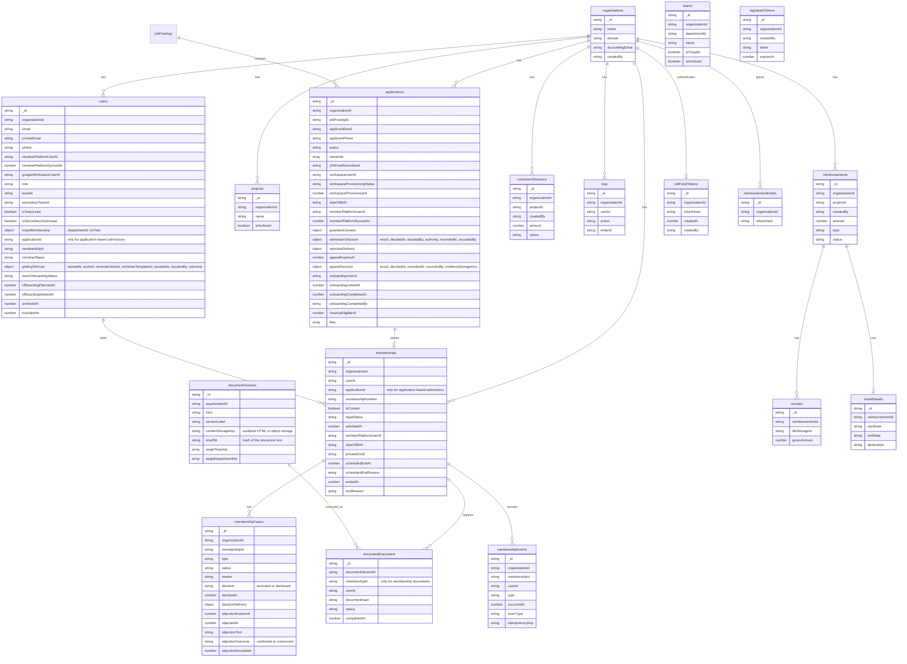

# Database schema

MongoDB stores the following application collections. Every business entity is
scoped through its `organizationId` or through a parent entity carrying that
scope.

Application files are embedded in the application snapshot so the application
and its initial per-file import status are stored atomically. Source URLs remain
server-only. Imported objects use deterministic storage keys; each file records
its status, attempt count, error and final object key.

Accepted applications hold the normalized YFN email and Google Workspace
provisioning state. The same application also records the formal admission
decision, any required guardian consent, rejection delivery and appeal. This
keeps the pre-membership procedure in the existing recruiting record instead of
creating a second application model. No temporary password is persisted. The
first matching Google login links the application to the onboarding user,
copies team and position from the job posting, and sets `cleanupEligibleAt` for
the retention workflow. Link conflicts stay on the application for correction
by P&C.

Members added manually have no recruiting application. Their membership uses
the confirmed member-platform profile for the birth-date snapshot and is linked
directly to the YBase user before the same onboarding documents are assigned.

For new ordinary YFN members, `memberships` is the legal source of truth.
A membership is created at the recorded admission time and contains the durable
admission evidence and required guardian consent. Details about who made and
recorded the decision remain on the application and in its history instead of
being duplicated on the membership.
Onboarding then uses the existing `users.memberStatus`: `onboarding` while the
new team member acknowledges the privacy notice and signs the special agreement
on work results, `getting_to_know` for the one-month getting-to-know phase that
follows, then `active`. Inside the phase, `users.gettingToKnow.outcome` marks
the decision: `confirmed` opens the bylaws and the membership application, the
other outcomes archive the account. No membership record exists before that
confirmation, so ending the collaboration during the getting-to-know phase is
immediate and follows no statutory notice period. Before admission, YBase resolves exactly one active member-platform
profile primarily from the applicant name. The private application email only
disambiguates people with the same name and remains a fallback for applications
without a usable name. YBase stores the profile's external ID, birth-date
snapshot and sync time on the application; the birth date is not a search
criterion and is not collected again in YBase. A missing or ambiguous profile
blocks admission; a free global profile search is not exposed. The accepted
onboarding user inherits the confirmed external ID. Onboarding document
executions reference the user; only the bylaws execution references the
membership. Individual tasks determine progress without
introducing a second aggregate operational status. Current board authorization
continues to use `users.boardMembership`; there is no parallel mandate
collection. The internal `memberships.legalStatus` supports legal workflows but
is not displayed as a parallel lifecycle:

The existing YBase profile linker remains available only to legacy users
without `membershipId` and exposes at most one unambiguous suggestion. Once a
membership is managed in YBase, login refreshes no longer overwrite its private
contact data from the member platform.

- `active`: membership continues without a pending legal termination.
- `resigning`: a resignation was received and the membership continues until
  `scheduledEndAt`; it is not awaiting approval.
- `suspended`: the exclusion decision was delivered and all membership rights
  are suspended during the internal remedy process under § 5.4.
- `ended`: membership no longer exists; `endReason` records why.

After the official offboarding workflow, `archived` is the terminal status for
ordinary departures and `excluded` is reserved for a final formal exclusion.
The legacy value `offboarded` is migration-only and must not be written by new
membership workflows. `membershipEvents` is append-only; sensitive case content
remains in `membershipCases` and is intentionally absent from the general
`logs` collection. `membershipCases` is limited to warnings and exclusion
proceedings. Resignation, age limit and death are termination facts on the
membership itself.

The authoritative field definitions live in
[`app/lib/db/types.ts`](../app/lib/db/types.ts), while indexes are defined in
[`app/lib/db/indexes.ts`](../app/lib/db/indexes.ts).
